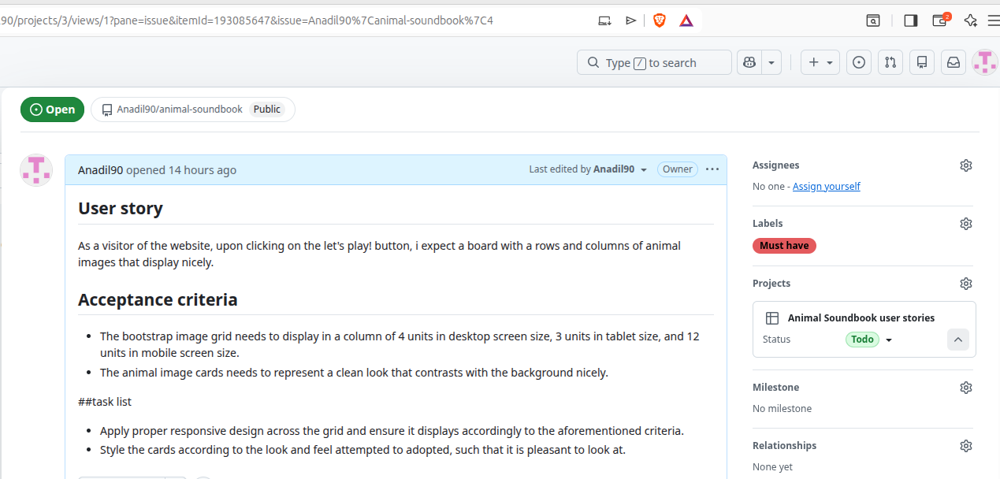
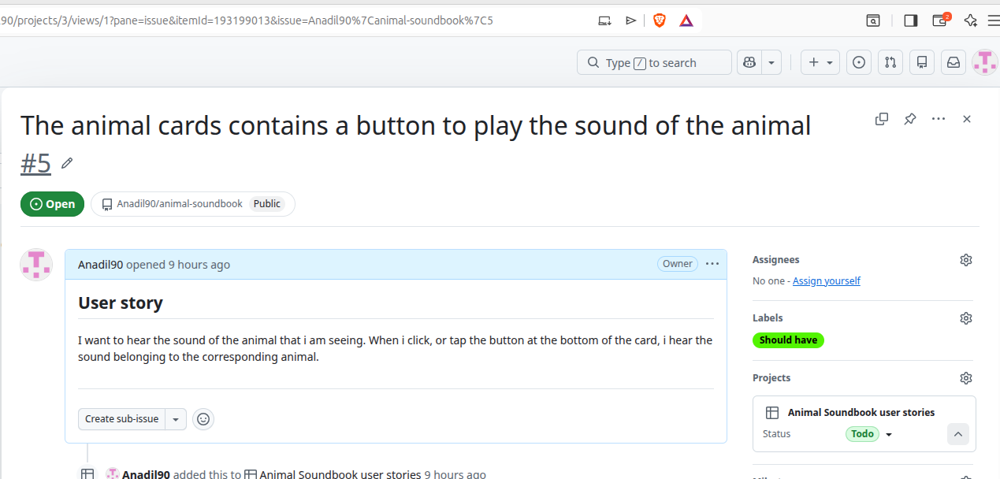
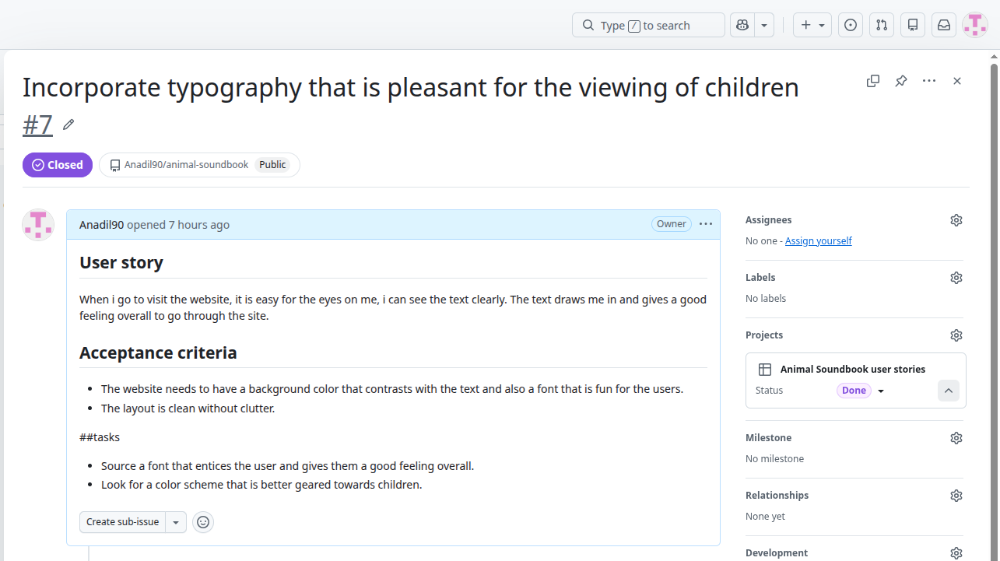
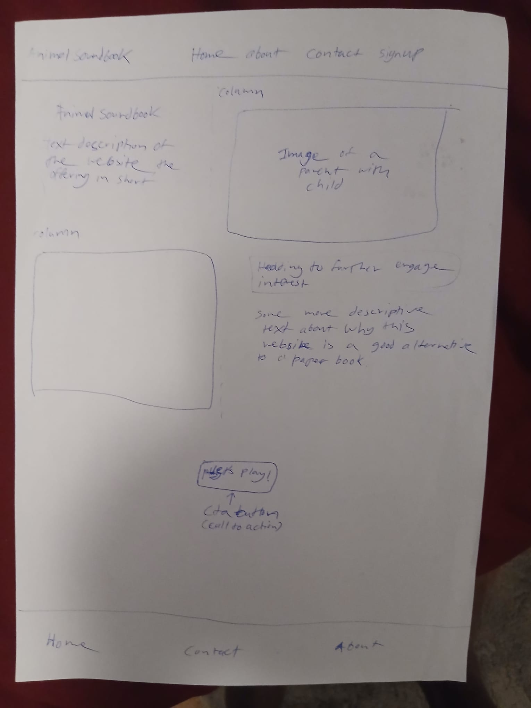

# animal-soundbook

Animal soundbook is a simple website that serves as a visual cue learning aid for children. The website was designed with the intention to make learning animal names and animal sounds a little bit more enjoyable and fun. The app will also serve as an experiment to gauge the interest of children in learning.  

# Features 

The website features a board in a grid that contains images of animals, along with a fun text that defines the sound that the animal makes. At the bottom of the animal card, is a button to play the sound of the animal, so that kids can have an audio feedback to add to the learning experience. The typography of the website is reflected to be more subtle, yet playful, aimed towards children as the main audience. 

# Primary business goals of the website

Animal sounbook is not trying to reinvent the wheel, rather the goal is to take something that exists mainly in static form, and give it an interactive touch that is a bit more interesting than paper books. The website aims to draw in two groups of audiences:
1. Parents of children
2. Children

The home page serves as the primary point of the call to action, where engaging text attempts to draw in the audience to the call-to-action, which is clicking the play me! button and landing on the page where the users see the animal card grid. Drawing the interest of parents mean a likehood of the website being used for their children. When children tend to use the website on a considerable scale, the primary goal of the website has been considered to be fullfilled.

## As users, the following would be expected upon visiting the website:
- I see a pleasant layout with nice contrasting colors.
- I am able to easily find out with a short glance what the webiste is about, and what it can offer.
- Clicking on the let's play button will lead to exactly, or closely what has been described on the home page.

## Typography choices
Upon research, I have found that children are attracted towards bright colours like red, orange and yellow, which utlimately increases a child's attention to detail. Based on this I have decided to go with a sort of a sunburst color #FFD34E for the background of the Bootstrap cards. This color, I feel, contrasts nicely with the color of #FFF2D9, which is basically a cream white color. For the background color of the body, the color #F1C40F has been chosen. For the border of the cards, the color #6CB4EE has been applied for a subtle contrast between the background and the cards, giving a more tactile look to the cards. For the header the color burlywood has been utlized to serve as an element of seperation from the background. The blackfonts are easy to read with this color for header background.

I have sourced the color hex codes from here: [The 20 Best Kids Color Palettes with Hex Codes & AI Design Examples] (https://www.media.io/color-palette/kids-color-palette.html)

## Manual testing

**Expected:** 
- The page that displays the bootstrap grid with animal tiles should be responsive and have images that scale properly. 
- The buttons to play the animal sounds should play the sound made by the animal.

Tests conducted: 
- Resize the browser window manually by clicking and dragging the window to different breakpoints, and inspect whether the grid properly displays the cards according to the column units specified for each of the columns. In addition, inspect whether the card images on the bootstrap grid scale properly in terms of width on different breakpoints by applying the same technique. 
- Play each of the animal sounds on the animal card grid by clicking the button and ensure that the sound is heard.

Testing result: 
- Upon first viewing the interactive soundbook page of the website, it has been found that the main section pops up above the header, which seems to be an issue with the bootstrap grid itself. 
- The bootstrap cards do display in a grid with the column layout specified with the classes, but appears to not fit properly within its' container. The primary issue is that the cards spill out of the container and the out of the row.
- The buttons don't have the level of interactivity as being proposed to the user. 

Fixes
- Applying margin to the top  of the section, along with applying a z-index value of 0 on the section in the page with the animal tile grid, and a z-index value of 4 on the navbar solved the issue of content overflow. 
- An audio element has been nested inside the h3 heading of the card body in the bootstrap card. The audio element was resized to fit inside the h3, and will serve as the means to play the sound of the animal in the animal tile grid. It was attempted to play the sounds with a small javascript snippet, but that proved to be out of the scope of the project due to the complexity of getting the script to play all the sounds of the animal, instead of just one. For this reason, the script snippet was removed from the bottom of the body, and the audio element was implemented in its place. The audio elements does the job nicely, and was not too difficult to set up. 
- The controls of the audio element has been hidden with a span nested inside the bootstrap card title, and changing the background color of the span to the background of the audio element, which is whitesmoke.

**Expected:**
- The navbar should have nav links that are centered and positioned in the right place, as expected of most websites that users come across. Users are used to the main nav links used to navigate websites on the right side, and the main home link with the logo or wesbite brand to be on the left side, and spaced properly against the left. 
- The navbar should be responsive with font sizes resizing according to the screen width, and collapse on mobile screen sizes in order to allow users to see the nav links by clicking on the burger menu. 
- The nav links collapse down from under the main brand link, so that the user can easily associate the website name with the content. The links are clearly visible with nice contrasting between the navbar background and the nav links. 
- All nav links appear on the navbar accross all pages.**

Tests conducted - 
- Inspect the navbar element with dev tools of the web browser to determine the position and spacing of the nav links.
- Resize the browser window to see whether the nav links are readable and of the right size according to the different screen sizes.
- Determine whether the navbar collapse menu is triggered in screen sizes of below 768px by dragging the browser window.
- Use the device toolbar of the browser dev tools to trigger mobile screen breakpoints of 320px, 375px, and 425px to examine whether the collapse menu can be seen on these breakpoints.
- Inspect the head of all the html documents for typos, missing closing tags or incorrect cdn links. 
- Click on the burger menu and ensure that the nav links drops down from the top, and that the links can be easily read.
- Navigate to each page and make sure that the nav links show up on the navbar on all of the pages.

Testing result - 
- On mobile screen sizes of 320px, it has been found that the navbar simply overflows to the top of it.  
- The nav links are not spaced and placed accordingly. 
- The collapse menu triggers at the wrong breakpoint, therefore making the links close in together at the medium breakpoint, and only triggers at 320px screen size.
- The white background of the navbar is not so nicely contrasted with the color of the nav links
- The nav links drop down from under the navabar brand link, but its stretched to the full width of its container #navbarSupportedContent, making the active class apply the border to the full width. This display is not desirable. 
- The main nav links are in the middle of the nav element instead of the right. 
- The brand link is not spaced against the left. 
- Clicking on the hamburger menu does not perform any action. Therefore, it is non functional on mobile screen sizes. 
- The nav link for the signup page does not show up on the home page and the contact page. 
- The nav links are too big on mobile and tablet screen sizes.
- Upon a closer look, it has been found that the cdn links to bootstrap in the link tags on the head of all pages except the soundbook.html page were pointed to bootstrap version 5.3.3. This version of bootstrap causes issues when attempting to collapse the navbar.

Fixes - 
- Upon examining the pages, it has been found that the nav-link element for the signup page was missing. Issue has been resolved by placing the respective link in the pages. 
- The nav element of all pages had a class of .navbar-expand-sm. This was the wrong class, making it trigger the navbar hamburger menu only at the small screen(320px) size. This has been changed to .navbar-expand-md to collapse at the 768px breakpoint.
- Width of the nav links have been reduced by setting the property and value width:fit-content to the .nav-item class in the stylesheet. Background color of aliceblue has been applied to the #navbarSupportedContent container to contrast the nav links better for viewability.
- The nav links have been vertically centered by applying the vertical-alignment property, and the main nav links have been moved to the right of the navbar by applying the align-items property. 
- The navbar brand link has also been centered by using the vertical-alignment property as used for the nav links, and in addition, a margin of 40px has been applied to move the brand link away from the horizontal start axis of the navbar. The brand link being too close to the start axis was logged as being an issue of distraction for the user. The same applies for the nav links being in the center instead of the right. 
- A global font size of 1.8rem has been set for the body that accomodates the mobile screens nicely, and also is large enough to be discerned on the medium and large screen breakpoints. The website has been tested on a Samsung Galaxy A16 phone, as well as a Lenovo Tab P12 tablet device in addition to the device toolbar and manual browser window resizing. On the Galaxy A16, the global font size of 1.8rem is perfectly readable and makes the font family caveat look quite nice. On the Lenovo Tab P12, the font size of 1.8rem is clearly readable and also seems perfectly suited for the screen size in terms of readability. On the desktop and laptop sizes, it holds up fine, allowing for good viewability of the nav links without difficulty. Owing to this, can be deemed that the global font size is able to cater to the major screen sizes and further media queries to resize the nav links is not neccessary. 
   
- The cdn link to bootstrap has been changed to bootstrap 5.3.8 to solve the issue of the navbar hamburger button not triggering the dropdown for the nav links on mobile screen sizes. The button now successfully triggers the drop down menu and shows the nav links.

**Expected:** 
- The images and text on the home page should resize and fit in their columns fluidly, so as to represent responsive design. This should be according to the respective breakpoints across various devices. 
- The images should have an aspect ratio similar or close to that of each other, so that they are able to be resized nicely.**

Tests conducted - 
- Resize the browser window manually and determine if the images and text on the bootstrap columns resize in accordance to the main breakpoints for mobile, tablet, laptop and desktop screens.
- Inspect and ensure that the images are of the same widths, and resize accordingly in respect to the screen sizes.

Testing result -
- Sizing of the images and their description text on the home page is garbled and does not represent the proper layout expected of responsive sizing on mobile screens. Font sizes do not resize accordingly to fit in their columns when the browser window is resized to smaller widths, making the text distracting to read, as well as obtrusive and oversized. 
- Font sizing is not uniform across different screen widths. 
- The first image next to the description text is too high and not too wide. This makes it look non-uniform as compared to the aspect ratio of the other image below on the third column. 
- There seems to be no indication as to whether the content of the columns belong within a particular boundary. This makes the text and image simply blend and mix into the background, which would be deemed as not being so accessible to the user in terms of visual clarity. 
- When the images scale down in size, they occupy the start of the vertical axis, which in turn gives the appearance of a gap existing on the bottom of the column. This makes the text look disproportionate as compared to the scaled down image on certain breakpoints.
- There is extra space on top of the columns for image descriptions on the home page, which further pushes the text down from the images.  

Fixes: 
- The first image of the column next to the description text has been changed to another image that has a aspect ratio more closely matching that of the second image. This has made the scaling more smoother and uniform.
- The default font size for the body, along with the navbar brand link and the nav links has been changed to 1.6rem for a more uniform sizing of the text in relation to the screen sizes. 
- The font size of the description paragraphs on the home page has been changed to 1em for more responsive sizing.
- A background color of #ffa9 has been applied to the row for a more subtle touch to the content of the row. A gap of 30px on the row seperates the content from each other, as well as a padding of 30px to the top and bottom and 10px on the left and right makes it look a bit better. There is now a clear distinction between the main background and the row.
- The columns of the row in the home page has been centered by applying the property and value align-content:center. This gives a more clean and consistent look to the content on laptop and desktop screen sizes, as well as negate the need for an excessive margin on top of the image description heading to push it down.
- On the breakpoint between 768 and 992px, the columns has been placed accordingly to line with the text by using the align-content property. On the fourth column, which is the column for the description text of the second image a margin of 90px has been added to push down the description text to be level with the image.  
- A margin of 20px to the top of both the description columns for the images on the home page has been removed from the .description-column style declaration. It is not applicable anymore, as the property row-gap does the work of spacing apart the columns on the row. At this point, the extra spacing needed to be removed. 

**Expected:**
- The call to action button on the home page should be resize accordingly when the mobile and tablet screen breakpoint has been triggered.

**Test conducted**
- Resize the browser window and determine whether the call to action button is of the proper size according to the viewport size.

**Testing result**
- Button is same size as it is in the other breakpoints for larger screens. 

**fix**
- The font size of the button has been reduced to 20px to better fit the small viewport of mobile devices and medium screen size devices, such as tablets. The font size compliments readability due to the font family being applied globally. On screen sizes larger than 768px, and screens of up to maximum of 992px, the font size of 23px has been applied to the cta button, as it compliments the sizing of the text content in the page. The default font size of 27px is applied on breakpoints larger than 992px, due to the media query specified up to a maximum of 992px. 

**Expected:**
- The footer links are positioned properly, centered on the middle of the footer. On mobile breakpoint, three main footer links deemed neccessary for the user are visible. 
- On screen sizes bigger than 768px, the sign up link is displayed, and on screen sizes smaller, the sign up link is hidden to accommodate the nav items properly on the footer. 
- The footer links all open their respective relevant links, such as, home opens home page, about opens about page, and so on.

**Test conducted**
- Click all the links and verify whether the link navigates to the proper corresponding page.
- Inspect the footer and determine whether the href attributes of the footer links are correct.

**Testing result**
- The footer links are off-center and all links try to fit along the footer, which is not the desired outcome. They are also not properly visible on screen size of 320px for mobile, which makes it difficult to see the footer links. 
- The footer links all navigate to the wrong pages. None of them take the user to the correct page.

**Fix**
- The footer links have been centered vertically by using the property align-items:center, and horizontally by using the text-align property. The hierarchy of the links on the footer were not in a fashion that users can easily navigate through the website. 
- The hierarchy has been changed to be first Home, then About and at last Contact for the mobile breakpoint. On screen sizes larger than 768px, the sign up link shows up. On mobile screens, the display of the sign up link is hidden. 
- The href attribute of the footer links have been corrected to navigate to the proper links when the user clicks on them.
- The href attributes of the footer links all had absolute paths to the html documents. This is wrong, and can cause conflicts with page navigation on the deployed site. This has been rectified by ammending the href attribute to point to the relative paths of the documents.

**Expected: The description column on the about page should be readable on all screen widths and be sized accordingly with respect to the screen breakpoints**

**Testing result**
The about paragraph was found to be squashed in from top to bottom. Upon reviewing the page structure, it was found that the paragraph was contained in column of 6 units, which is not neccessary. An inline style was found applying margin to the top of the section. 

**Fixes** 
- The bootstrap column was unneccessarily divided into two columns, where it seemed evident that perhaps the second column was not meant to have any content. The column class was changed to .col-lg-12  from col-6 to take up the full width of a single column. As it is a description paragraph, one column is more suited to it. The column is now responsive, making it easier to read the text content. 
- An inline style applying margin to the top was moved to the main stylesheet, as there is no need to explicitly enforce higher specificity just to apply this style.

**Expected: The section with the Animal tile grid is responsive and contains the animal tiles within it without spilling over the boundaries of the section. The grid is centered and contains tiles of the appropriate dimensions in terms of height and width.**

**Test conducted**
- Resize the browser window and determine whether the bootstrap grid has a proper layout, in terms of the tiles displaying according to the column classes being applied, as well as responsively resizing according to the screen width. 
- Inspect the individual breakpoints for mobile, tablet, laptop and desktop screens with the dev tools of the browser to assure that the content of the grid is resized properly, in addition to ensuring that the grid is properly spaced and aligned along the body.

**Testing result**
- The initial testing made it clear that the bootstrap grid was spilling its' content out of the container. Upon viewing the soundbook page, the entire container seemed to be out of place, as if it was forced to be positioned out of the normal position flow. Attempting to increase the width of the container resulted in it actually shrinking the content. It was clear there was a mess up either in the bootstrap grid, or the main container. 
- Upon checking the invidual breakpoints of 320px, 375px, 425px, and 768px, it became clear that the card images are of the improper width compared to the height on these particular breakpoints. 

**Fixes** 
- Upon inspection, it was found that there was an extra div in the bootstrap row that caused the bootstrap grid to break and display the cards properly. The div was removed and that resulted the grid containing the cards within the row, and not spilling out of it.
- The container class was used in the section element. Upon googling the issue, it was found out that it is not the best practice to apply the container class on a section, but to rather nest a div inside the section and apply the container class on it. Removing the container class from the section itself proved to be fruitful, as the grid right then displayed properly, placed along the center of the body. Placing the row inside of the container made the grid display exactly as the way it was meant to be displayed, clean with spacing. 

- A media query declaration is being used to apply a width of 9.3em, and height of 9.5em to the card image. This is resulting in the bootstrap cards being too tall in appearance. The width:height ratio therefore is not correct. It has been further found out that the .card style declaration on the media query breakpoint of between 320px and 768px was applying a width:fit-content property to the card. This unneccessary declaration was causing the issue of the card images not scaling properly. The global width and height properties of the .card class declared in the generic styles of the stylesheet suffices to size the cards accordingly. The unneccessary style declaration was removed from the media query breakpoint of between 320px and 768px to circumvent the issue.

## Further problems and fixes

- Many redundant styles, inlcuding media queries, were found on the main stylesheet. The styles had minimal, or no effect on the elements, or were duplications of media queries that could have been consolidated into one single media query line. These styles were removed.

- The animal tile grid section section overflows on top of the navbar on the page to play the animal sounds. Setting a z-index property to the value of 3 solved the issue. Furthermore, this property was also found to be placed at the media query breakpoint of 992px for both the #main and .navbar element, when it was not required to be there at all. The property was moved to the .navbar style declaration as a global declaration for all the pages. There is absolutely no need for a media query declaration just to do this.

- The property and value align-self:center applied to the images on the home screen are redundant now, because of other properties present to align and space the content on particular breakpoints. It, along with the .description-column style declaration for the columns has been removed.

- A .col-6 style declaration was found in the stylesheet, but this class does not exist anymore. This redundant style declaration has been removed.

- The bootstrap row on the soundbook page has sharp edges that just does not seem to fit in with the view of the webpage. The borders have been rounded to look smoother and look more elegant. This overall affects the look of the page and seems better. The bootstrap row on the soundbook page has been given a custom class name of animal-tile-row, so as to not apply the style to all other pages across the website. On screen sizes up to 575px, a media query has been added to disable the border radius, as the display of the row is better without it, allowing the row to blend in with the background.

- An unused id of id="home" has been found on one of the footer links. This is not at all now neccessary, and therefore has been removed.

- The text for the a tag of the sign up page was missing from the tag on the footer across all pages. The text has been added to all the tags of the respective link. This was probably erased while ammending the href attributes of the links.

- The .col-md-6 and .col-lg-4 classes had a display:flex and justify-content: center property applied to them globally in order for the bootstrap cards on the soundbook page to be centered. But doing so also affected the columns on the home page that has the same class. This caused the content of the row to appear scrambled, as the row in the home page was not originally meant to be flexed. The issue was mitigated by adding a custom class of on the div with the column classes, and then changing the class selector in the stylesheet to the new custom class.

- An extra style declaration for the body was found to apply global font size to the body. There is already a main declaration for the body styles, which makes two declarations for the body. This font size property for the duplicate body style declaration has been moved to the main body style declaration and the duplicate declaration below it has been removed.

- The font size of the about paragraph in the about page is the same size globally, as well as on the media query breakpoint of between 320px and 768px for mobile and tablet devices. This is a improper style application, and is causing the about paragraph to be too small on medium sized devices and devices with larger screens. The global font size for the about paragraph has been changed to 1.5rem for better viewability. The font size now scales from larger to smaller, which is the desired output.

- The font sizes of the labels, inputs, and buttons for the forms on both the contact and sign up pages are oversized. This worsens the look and feel of the form. It was found that there was no default specified font size for the labels, inputs and the form buttons. This means that the global font size of 1.8rem was applied to the elements on both pages, that made them look oversized. The labels and inputs of the forms has been targeted by their column classes and a font size of 1.4rem has been applied to those elements on both pages to rectify the issue. The buttons have been seperately targeted by the .custom-button class and resized with custom dimensions to compliment the look of the form. 

- The required attribute for the password input element on the sign up form was present, but the validation was not being carried out for it. The form validation for this field and the user feedback styles therefore were not being applied. The missing attribute has been placed on to the input element for the password once more. The styles to show the user feedback for the password field was also missing. The style declaration and properties for the user feedback has been placed at the stylesheet to show user feedback for empty field or text lower than 8 characters. 

- The sign up information text for the user below the sign up form was too big. It was found that the text was contained inside an h1 paragraph heading. This is not appropiate for the use case as the proper practice would be to put the text in a paragraph element and then size the text acordingly. The issue has been rectified by changing the h1 heading to a paragraph with the id signup-text, in order to select and apply a font size of 1.4rem for mobile, and 1.6rem for screens larger than 768px. Again, here the global font was kicking in, making the text oversized.

- The sign up text should be on top of the form element. In terms of information hierarchy, it seems wrong, or simply counteractive for the text to be below the sign up button. The user is supposed to read the text first and then begin filling up the form, not the opposite! The paragraph has been placed on the top of the form to improve user interaction.

## Deployment and live project viewing ##

### How to view the project ###

Simply go to the link below to see the delpoyed site:
[Animal Soundbook] (https://anadil90.github.io/animal-soundbook/index.html)

### Development environment and platform ###

The website was primarily developed on a local development environment setting running on linux. Vs code was used as the IDE, due to its extensive offering of extentions that offers great help with the development process. The operating system used for the development environment setup was Ubunbtu 24.04.4 LTS. The folders and files were all stored on the local machine, and were first staged and commited locally, then pushed to a remote repository with git as the version control system.

### Git repository and deployment procedures ###
A git repository is required to host the files and folders remotely. It serves as a safe point to revert back to a previous version of the development history, in case of a mishap or major issue. The repository for this project was set up by logging on to github and pressing on the + icon and then selecting new repository. On the following page the neccesssary details were filled out and then the remote repository was created by clicking on the create repository button. To learn more about github and the use of repositories, you can go to the following links: 
[Github repositories] (https://docs.github.com/en/repositories/creating-and-managing-repositories/about-repositories). 
[creating a repository] (https://docs.github.com/en/repositories/creating-and-managing-repositories/creating-a-new-repository)
The project was deployed with github pages, which is a feature of github that allows developers to host a static website developed with HTML, CSS and Javascript for live viewing. The documentation on the following link about github pages can give a clearer idea of how to intitiate a live site with github pages: [Github pages] (https://docs.github.com/en/pages/quickstart)

The steps to create to initiate a git repository on the local machine for staging and deployment were as follows:
1. A terminal to the project root directory was opened by navigating to view -> Terminal in the navigation menu of vs code. This can also be done with the keyboard shortcut: ctrl + ~.
2. An empty git repository was initiated by typing in the command git init.
3. The branch for the project repository was switched to main in order to allow the staged commits to be pushed to the remote respository by using the command: git branch -M main. Main is usually the default branch of the github repository and also the branch from which the live github pages website is deployed.
4. The remote repository to host the files and folders of the project was added by using the command: git remote add origin url, where url is the address of the remote repository. More details about adding remote repositories can be found on the following link below: 
[Github remote] (https://docs.github.com/en/get-started/git-basics/about-remote-repositories?versionId=free-pro-team%40latest&productId=pages&restPage=quickstart) 
5. The files to be tracked for adding to the remote repository were added by using the command: git add filename, where filename corresponds to the filename extention of the file, such as index.html. Using the command git add . adds all the files and folders on the parent directory of the project.
6. The added files and folders for staging were prepared for pushing to the remote repository by using the command git commit -m "message", where "message" is the message justified for the commit.
7. The staged code was pushed to the remote repository by using the command git push -u origin main, that sets the commits from the local machine to be automatically pointed towards the remote origin link and be pushed to the remote branch. By specifying -u on the command, the branch is set to be tracked automatically with every commit, and easily pushed by simply using the command git push

### Pre-requisites ###
To view the project on your local machine, you will need vs code on your computer. The link to download vs code for your operating system platform is given here: [vs code] (https://code.visualstudio.com/). Other than that, you will need a web browser such as Google Chrome, Mozilla Firefox, or Microsoft Edge to launch the website locally on your machine. As this is a static website without interactive javascript elements, it is possible to  directly run the website by double clicking on the index.html file without the need for further dependencies. However, the recommended way to live view the website while working on the codebase is to use the extention live server by Ritwick Dey. You can install the extention by going to the extentions menu on the left side (the icon with the four square tiles with one broken off). This extention allows you to automatically reload the integrated browser on vs code when the code changes, allowing for a smoother workflow. The extention will show up first when you search for it on the extentions menu. 

### Cloning and getting ready to contribute ###
To start working on the project for further improvements (that you may have in mind), you will need to clone the respository. To do so, you can either do it with the following command: gh repo clone Anadil90/animal-soundbook, or use the command to clone with the web url:  git clone https://github.com/Anadil90/animal-soundbook.git from the terminal in vs code. Alternatively, you can also download the entire project by clicking on the code button and then the download zip link. You will then need to extract the contents of the zip file into a directory on your computer, such as documents. 

### Branching ###
The branch for the project repository is main, and therefore the default branch for your local development environment should also be main. It should be noted that as of October 1, 2020, the default branch for all newly created repositories is main, as can be seen here: https://github.blog/changelog/2020-10-01-the-default-branch-for-newly-created-repositories-is-now-main/. Therefore, the expected branch for most projects now would be main, instead of the default master branch as was before October 1, 2020.

## User stories:

As a user of the website for the first time, I expect the webiste to be easily navigable and for it to be responsive across all devices. The information I am looking for should be quickly found without any frustations.

The user story has been met by implementing a simple easy to follow navigation heirarchy, as well as applying proper styling and media queries for the responsiveness of the website accross most common and  major breakpoints.  

Upon clicking the let's play button, I expect a board with rows and columns of animal images that display nicely.

The user story has been met, with the bootstrap grid displaying the animal tiles nicely, and are responsive on various screen sizes.

The animal cards contain a button to play the sound of the animal

This user story involved at one point implementing a minimum amount of javascript of a few lines in order to play the sounds. This actually roved to be counteractive, as the high level of javascript knowledge required to pull it off left a lot of unclear and vague ideas of how  to actually get the job done. The humble audio element, in the end proved to be far more suitable for the task of playing the animal sounds, and was implemented.

When I go to the website, it is easy for the eyes on me, I can see the text clearly. The text draws me in and gives a good feeling overall to go through the site.

The user story was met with typography to grab the attention of young children, through research into what colors primarily attracts them and helps them to concentrate. This is actually still an ongoing research on part of the developer to finely pinpoint the relation of typography choices with the efficacy of learning in children.

## Automatic testing

HTML validation: 

testing the pages showed that they were mostly clean, except for warning messages on the contact and signup pages.

### home page

## Lighthouse testing

The test revealed that a few things can be done to improve page load speed, but on the accessibility side, it seems to fare good.

## wireframes

The wireframe showed here initially was the designed being opted for. Thw wireframe helped to draw out the rough sketch in terms of what the website can look like. It was drawn by hand on a magnetic ink sketch board and then adopted on paper. 

## known issues
The sounds of the animals play synchronous to each other. This means that when one anial sound is played, another can also be played at the same time. There is nothing much that can be done about this behavior at this stage of the development of the website, as mitigating the issue means resorting to javascript, which is out of the project scope. This issue however, will be resolved in the future release of the website, along with the other desired features being implemented. As the core functionality of the website is delivered, this issue can be considered to be minor at this point.

## Feature improvements and additions ##
- The intitial number of animals was found to be too little in terms of animal choices. An ongoing attempt to create a rich collection of animals for the soundbook has been initiated. As of this writing, 7 more animals have been added to the animal tile grid.  

## Desired features of the website for the future ##
While this initial version of the website gives a taste of what can the users be offered, there remains room for some features that would be desirable, which are outlined below:
- sections for multiple categories of objects for children to learn, such as vehicles, fruits, vegetables, food items, etc. This idea stems from a childrens flip soundbook by Vtech. 
- A short video clip of the animal belonging to an animal tile is played when the user hovers over the animal tile. This feature requires selecting the card-img-top of the bootstrap cards in the DOM and then placing a video element on top of the card image for that paricular event.
- A choice of themes to apply to change the appearance of the website, to better suit the color preferences of the user. This can be a choice of three major themes in the forms of dark with contrast, light with focus, and balanced with asthetically pleasing background.
It should be noted that these are pre-eliminary ideas that may evolve over time, or may be adopted in a slightly different way than as defined here. 